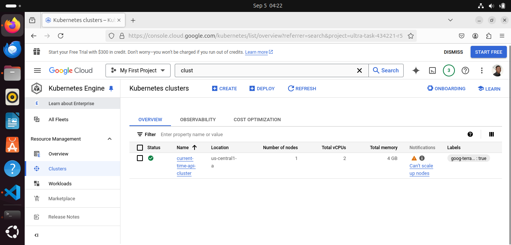
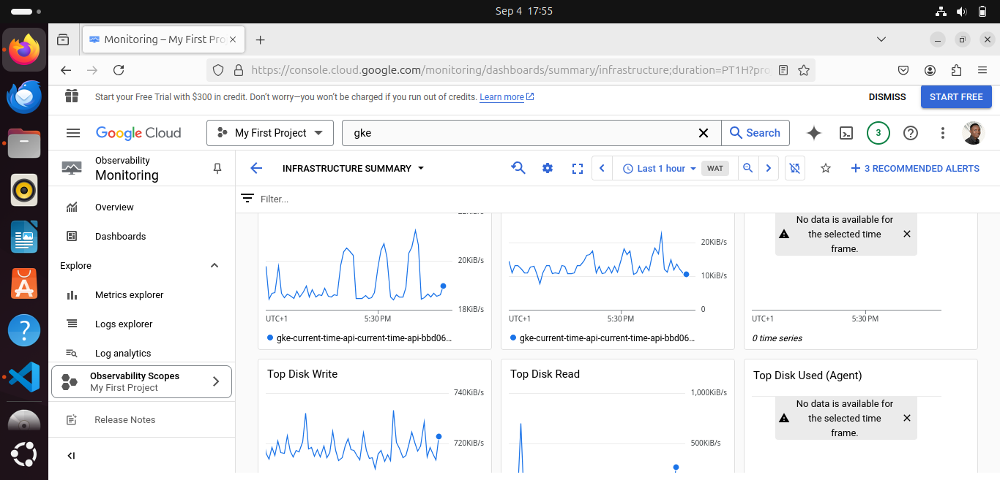

# Current Time API Infrastructure

This repository contains the configurations to deploy an infrastructure for a Current Time API on Google Cloud Platform (GCP). The infrastructure includes a VPC, NAT gateway,  Google Kubernetes Engine (GKE) cluster, IAM roles, and Kubernetes resources.

## Project Structure

```plaintext
Terraform/
├── Remote-backend/
│   ├── main.tf
│   ├── variables.tf
│   ├── outputs.tf
│   └── backend.tf
├── modules/
│   ├── gke/
│   ├── vpc/
│   ├── nat/
│   ├── iam/
│   └── k8s-resources/
├── main.tf
├── variables.tf
├── outputs.tf
├── backend.tf
└── terraform.tfvars
Current-time-api/
├── static/
├── templates/
├── app.py
├── Dockerfile
└── requirements.txt
```
### Prerequisites
Before deploying the infrastructure, ensure that you have the following:

- **Terraform**: Installed on your local machine. 
- **Google Cloud SDK**: Installed and authenticated with your Google Cloud account. 
- **GCP Service Account**: A service account with the necessary permissions to create resources in GCP.


## Step By Step Workthorugh

### Setting Up Current Time 
#### 1. Package Update
Before diving into the project, I used ubuntu for all my configuration, python comes pre-installed on ubuntu, so I just needed to make sure my local machine was  up-to-date and equipped with the necessary Python tools. Here’s how I did it:

```
sudo apt update
sudo apt install python3 python3-venv python3-pip
```

#### 2. Creating a Virtual Environment
To avoid conflicts with other Python projects and maintain a clean working environment, I created a virtual environment specifically for this Flask project:
```
python3 -m venv myenv
```
This command creates a virtual environment named `myenv`. The virtual environment created then helps to manage required  dependencies without affecting the local environment.

#### 3. Activating the Virtual Environment and Installing Flask
With the virtual environment created, I activated it and installed Flask, the framework used to build this application
```
source myenv/bin/activate
pip install Flask
```
`source myenv/bin/activate` activates the virtual environment and ensures that any Python packages installed are isolated to this environment.
`pip install Flask` is used to install Flask within the virtual environment. Flask is the lightweight web framework used to develop our application.

#### 4. Running the Flask Application
Once Flask was installed, I ran the application to verify everything was set up correctly. 
```
python app.py
```
This command runs the Flask application. If everything is set up correctly, the app should start running on the specified port (5000).

#### 5. Deactivating the Virtual Environment
After verifying that the application was running, I deactivated the virtual environment
```
deactiviate
```

### Containerizing the API with Docker
Next, I used Docker to containerize the api, making it easy to deploy and run in any environment. I created a dockerfile to this which can be deployed using this command
```
docker build -t current-time-api .
docker run -d -p 5000:5000 current-time-api
docker ps
```
- `docker build -t current-time-api .` is a command that builds a Docker image named current-time-api from the Dockerfile in the current directory. You have to ensure you are in the directory containing the dockerfile before running this command. 
- `docker run -d -p 5000:5000 current-time-api` runs a container from the current-time-api image, while mapping port 5000 on the host to port 5000 in the container.
- `docker ps` is used to list the running containers. If the container is running, you can access the application in your browser at `http://localhost:5000`.

### Setting Up Terraform Access for GCP
Seeing that the API is fully functional on docker, the next thing is to deploy it to an infrastrcuture  which will be done using Terraform. I configured Terraform to access Google Cloud Platform (GCP) by setting up the necessary environment variables
```
nano ~/.bashrc
export GOOGLE_APPLICATION_CREDENTIALS="/path/to/your-service-account-file.json"
source ~/.bashrc
```
The Terraform configuration is organized into multiple modules, each responsible for a specific part of the infrastructure. Here is a brief overview of the main components:
- **GKE Module**: Sets up the Google Kubernetes Engine (GKE) cluster.
- **VPC Module**: Configures the Virtual Private Cloud (VPC) networking.
- **Firewall Module**: Defines firewall rules for network security.
- **Kubernetes Module**: Manages Kubernetes resources like deployments, services, and namespaces.
- **Container Registry Module**: Handles the container registry setup for storing Docker images.
- **Monitoring Module**: Manages and monitors the activties within the infrastrcuture and sends an alert in case of any irregularities. 

### Setting Infrastructure
1. **Clone the Repository:**
```
git clone https://github.com/Better-Great/Shortlet-API.git
cd Shortlet-API
```
2. **Configure Terraform Variables**
Update the terraform.tfvars file with your GCP project details:
```
project_id       = "your-gcp-project-id"
region           = "your-gcp-region"
alert_email      = "your-email@example.com"
google_credentials = "path/to/your/google/credentials.json"
```
3. **Initialize Terraform**
```
cd Terraform
terraform init
```
4. **Plan and Apply Terraform Configuration**
```
terraform plan
terraform apply
```
5. **Verify Deployment**
- Check the GKE cluster status.
- Ensure the API is running as expected using the load balancer ip address
- Verify that monitoring and alerting are functioning correctly.


### Modules
#### Remote-Backend Module
This module is responsible for setting up the remote backend to store Terraform state files in Google Cloud Storage. This ensures that your Terraform state is stored securely and can be accessed from anywhere.

  

#### GKE Module
The GKE module creates a Google Kubernetes Engine (GKE) cluster. It includes configurations for the cluster's node pools, network settings, and IAM roles required for Kubernetes operations.


#### VPC Module
The VPC module sets up the Virtual Private Cloud (VPC) networking for the GKE cluster. It defines network subnets, routes, and other network-related resources necessary for the secure and efficient operation of the cluster.


#### Firewall Module
The Firewall module configures firewall rules to control network traffic to and from the GKE cluster. It ensures that only authorized traffic is allowed and that the cluster remains secure from potential threats.


#### Kubernetes Module
The Kubernetes module manages the deployment of Kubernetes resources, including deployments, services, and namespaces. It defines how the microservices are deployed and exposed within the cluster.


#### Container Registry Module
The Container Registry module handles the setup of Google Container Registry for storing Docker images. It allows the CI/CD pipeline to push and pull images required for deploying microservices to the GKE cluster. 


#### Monitoring Module
This module sets up monitoring and alerting for the GKE cluster and deployed application using Google Cloud Monitoring. It ensures that the application’s health and performance are continuously monitored.





